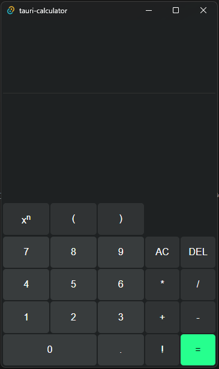

# Rust calculator
This is my first Rust project. It is a calculator with a custom parser. The goal of this project is for me to learn a bit of Rust and to get familiar with its syntax. 



## How to run
To run the program, simply clone the repo and run `cargo tauri dev` inside of the folder. 

## Parsing
I created the parsing with the help of this article: https://www.engr.mun.ca/~theo/Misc/exp_parsing.htm
### Grammar
```
S -> E end
E -> T {("+" | "-") T}
T -> F {("*" | "/") F}
F -> P | P "^" F
P -> (v | "(" E ")" | "-" T | {P "!"})
end expression has to be reached
```
- S = start
- E = expression
- P = primary
- T = term
- F = factor
- v = constant (a floating point number for now)

## Frontend
The frontend part is implemented using Tauri and pure html/js/css. The desing is heavily inspired by windows calculator. 

## TODO
- [x] error handling 
- [ ] racional results
- [x] negative numbers (unary operators)
- [x] float
	- [x] float input
- [ ] support for `**` operator
- [ ] functions (abs, sin, cos...)
- [x] postfix operators (factorial, ...)
- [x] write test cases
- [ ] roots
- [ ] fractions
- [ ] history
- [ ] exponential number notation (\*10^n)
- [ ] constants (pi, e, ...)